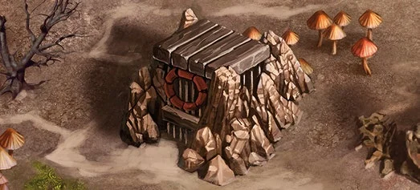

# Cyclops Stockpile

<figure markdown="span">

{ width="475" align=right }

</figure>

___

[Visitable Field](index.md#visitable-field)

___

When preparing the Neutral Army guarding this location, instead of drawing 1 :azure_tier: unit, find 2 :gold_tier: [Cyclopes](../units/cyclopes.md) and add them to the Neutral Army (look for them first in the :gold_tier: discard pile, and then in the :gold_tier: Neutral Unit deck). If you win the Combat, roll and resolve 4 [:resource_die:](../keywords/dice.md#resource-die). Any additional effects depend on the scenario.

___

## Zobacz też

- [Cyclops Stockpile (Creature Bank)](cyclops_stockpile_creature_bank.md)
- [Lista Pól](index.md)
- [Lista Kafelków](../tiles/index.md)
