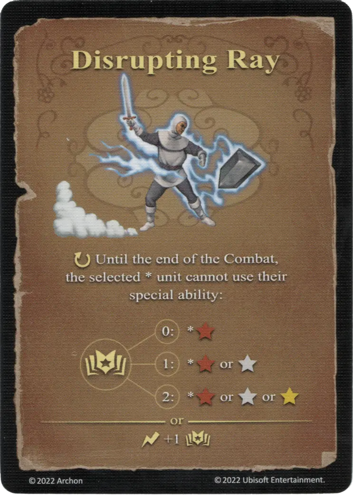

# Morowe Powietrze

{ width="340" align=right }

___

[Basic Air Spell](index.md#school-of-air-magic)

___

:ongoing: Until the end of the Combat, the selected \* [unit](../units/index.md) cannot use their special ability:  :power: 0 ➣ \*:bronze_tier: :power: 1 ➣ \*:bronze_tier: or :silver_tier: :power: 2 ➣ \*:bronze_tier: or :silver_tier: or :gold_tier:  — OR —  :instant: +1 :power:

___

## Pochodzi z

- [Pudełko Podstawowe](../content/core_game.md)

## Zobacz też

- [Szkoła Powietrza](index.md#school-of-air-magic)
- [List of Spells](index.md)
