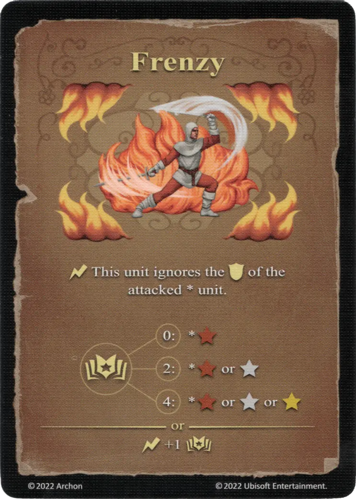

# Szał

{ width="340" align=right }

___

[Expert Fire Spell](index.md#school-of-fire-magic)

___

:instant: This [unit](../units/index.md) ignores the :defense: of the attacked \* [unit](../units/index.md).  :power: 0 ➣ \*:bronze_tier: :power: 2 ➣ \*:bronze_tier: or :silver_tier: :power: 4 ➣ \*:bronze_tier: or :silver_tier: or :gold_tier:  — OR —  :instant: +1 :power:

___

## Pochodzi z

- [Rozszerzenie Cytadela](../content/fortress_expansion.md)

## Zobacz też

- [Szkoła Ognia](index.md#school-of-fire-magic)
- [List of Spells](index.md)
