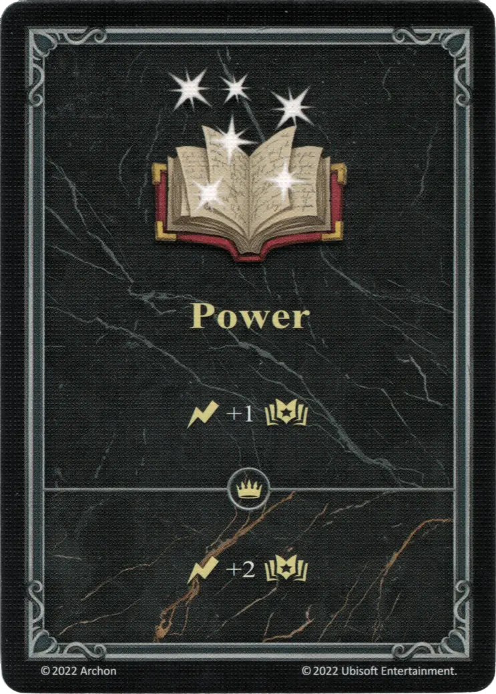
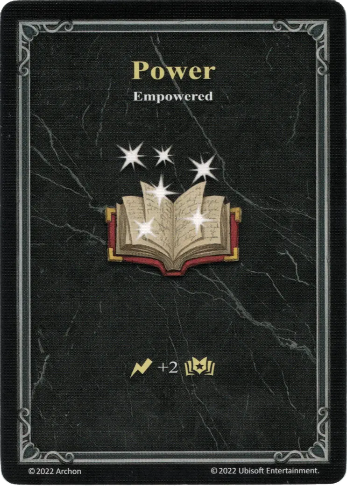

# Moc

=== "Regular"

    <figure markdown="span">
        { width="340" align=right }
    </figure>

=== "Empowered"

    <figure markdown="span">
        { width="340" align=right }
    </figure>

| Type |Effect | :expert: Effect |
| :--- | :--- | :--- |
| Regular | :instant: +1 :empower: | :instant: +2 :empower: |
| Empowered | :instant: +2 :empower: | - |

## Zobacz też

- [Lista Bohaterów](../heroes/index.md)
- [List of Statistics](index.md)
