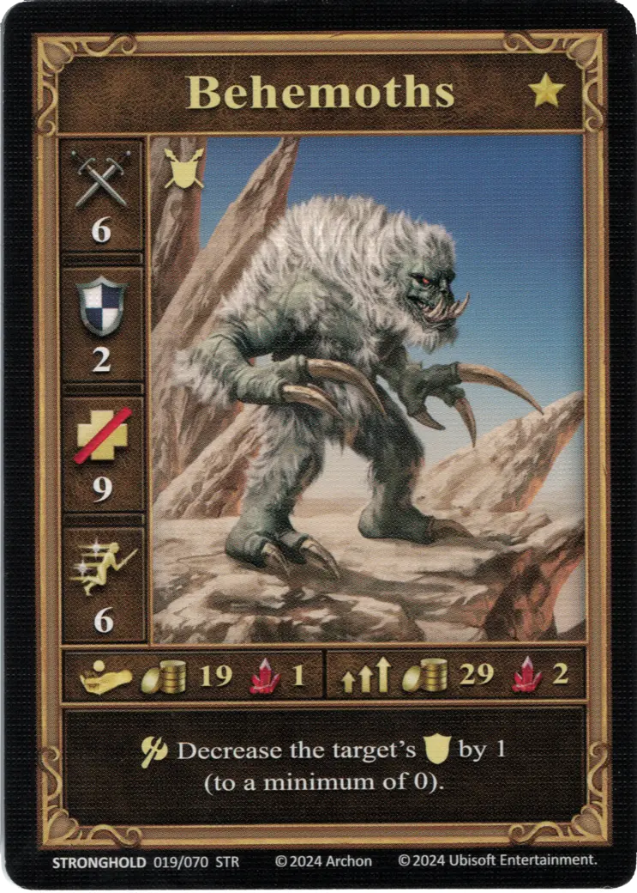
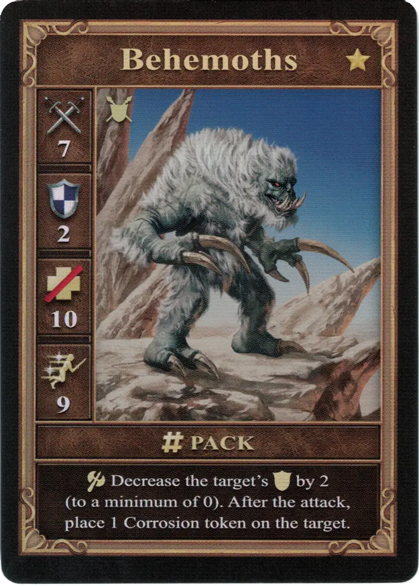
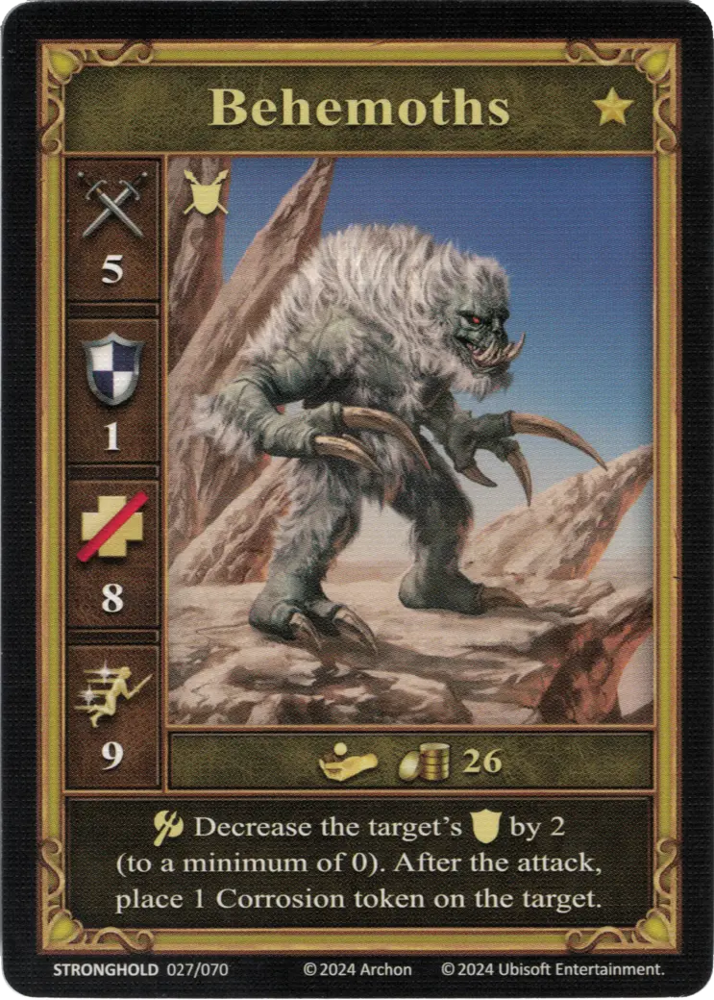

# Behemoty

=== "Garstka"

    <figure markdown="span">
        { width="340" align=right }
    </figure>

=== "Grupa"

    <figure markdown="span">
        { width="340" align=right }
    </figure>

=== "Neutralne"

    <figure markdown="span">
        { width="340" align=right }
    </figure>

| Statistics | Few | Pack | Neutral |
| :--- | :---: | :---: | :---: |
| Town | [Stronghold](../towns/stronghold.md) | [Stronghold](../towns/stronghold.md) | [Neutral](../towns/neutral.md) |
| Tier | :gold_tier: | :gold_tier: | :gold_tier: |
| Type | [:ground_unit:](index.md#ground-units) | [:ground_unit:](index.md#ground-units) | [:ground_unit:](index.md#ground-units) |
| :attack: | 6 | **7** | 5 |
| :defense: | 2 | 2 | 1 |
| :health_points: | 9 | **10** | 8 |
| :initiative: | 6 | **9** | 9 |
| Cost | 19 :gold: 1 :valuables: | 29 :gold: 2 :valuables: | 26 :gold: |
| Abilities | :unit_attack: Decrease the target's :defense: by 1 (to a minimum of 0). | :unit_attack: Decrease the target's :defense: by 2 (to a minimum of 0). After the attack, place 1 Corrosion token on the target. | :unit_attack: Decrease the target's :defense: by 2 (to a minimum of 0). After the attack, place 1 Corrosion token on the target. |

## Pochodzi z

- [Rozszerzenie Twierdza](../content/stronghold_expansion.md)

## Zobacz też

- [Lista Jednostek](index.md)
- [Lista Miast](../towns/index.md)
