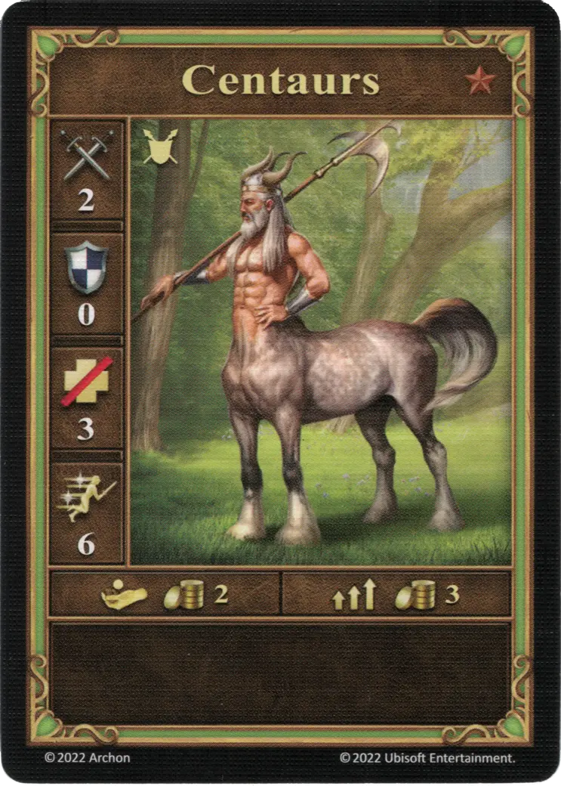

# Centaury

=== "Few"

    <figure markdown="span">
        { width="340" align=right }
    </figure>

=== "Pack"

    <figure markdown="span">
        { width="340" align=right }
    </figure>

=== "Neutral"

    <figure markdown="span">
        { width="340" align=right }
    </figure>

| Statistics | Few | Pack | Neutral |
| :--- | :---: | :---: | :---: |
| Town | [Rampart](../towns/rampart.md) | [Rampart](../towns/rampart.md) | [Neutral](../towns/neutral.md) |
| Tier | :bronze: | :bronze: | :bronze: |
| Type | [:unit_ground:](index.md#ground-units) | [:unit_ground:](index.md#ground-units) | [:unit_ground:](index.md#ground-units) |
| :attack: | 2 | **3** | 2 |
| :defense: | 0 | 0 | 0 |
| :health_points: | 3 | 3 | 5 |
| :initiative: | 6 | **8** | 7 |
| Cost | 2 :gold: | 3 :gold: | 3 :gold: |
| Abilities | - | - | - |

## Pochodzi z

- [Rozszerzenie Bastion](../content/rampart_expansion.md)
- [Tower Expansion](../content/tower_expansion.md) (Neutral)

## Zobacz też

- [Lista Jednostek](index.md)
- [Lista Miast](../towns/index.md)
