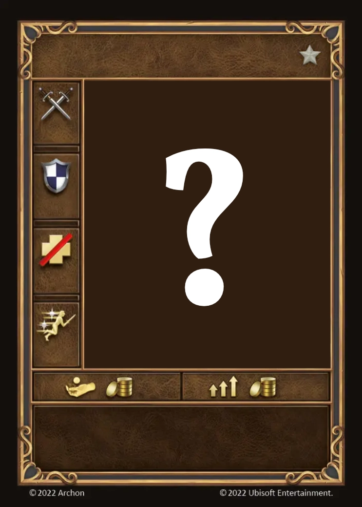

# Żywiołaki Energii

=== "Few"

    <figure markdown="span">
        { width="340" align=right }
    </figure>

=== "Pack"

    <figure markdown="span">
        { width="340" align=right }
    </figure>

=== "Neutral"

    <figure markdown="span">
        { width="340" align=right }
    </figure>

| Statistics | Few | Pack | Neutral |
| :--- | :---: | :---: | :---: |
| Town | [Conflux](../towns/conflux.md) | [Conflux](../towns/conflux.md) | [Neutral](../towns/neutral.md) |
| Tier | :silver: | :silver: | :silver: |
| Type | [:unit_flying:](../keywords/flying_unit.md) | [:unit_flying:](../keywords/flying_unit.md) | 🚧 |
| :attack: | 3 | **4** | 🚧 |
| :defense: | 1 | 1 | 🚧 |
| :health_points: | 5 | **6** | 🚧 |
| :initiative: | 5 | **8** | 🚧 |
| Cost | 5 :gold: | 8 :gold: | 🚧 |
| Abilities | - | :activation: Add +1 :empower: to the first [Fire Magic](../spells/school_of_fire_magic.md) spell you cast during this Activation. | 🚧 |

## Pochodzi z

- [Conflux Expansion](../content/conflux_expansion.md)

## Zobacz też

- [Lista Jednostek](index.md)
- [Lista Miast](../towns/index.md)
