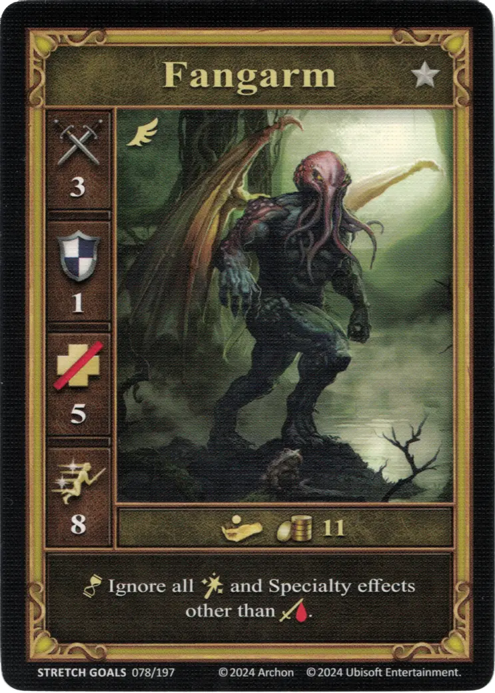

# Fangarm

<figure markdown="span">
    { width="340" align=right }
</figure>

| Statistics | Neutral |
| :--- | :---: |
| Town | [Neutral](../towns/neutral.md) |
| Tier | :silver_tier: |
| Type | [:flying_unit:](index.md#flying-units) |
| :attack: | 3 |
| :defense: | 1 |
| :health_points: | 5 |
| :initiative: | 8 |
| Cost | 11 :gold: |
| Abilities | :unit_passive: Ignore all [:spell:](../spells/index.md) and [Specialty](../heroes/index.md) effects other than :damage:. |

## Pochodzi z

- [Regular Stretch Goals 2024](../content/regular_stretch_goals.md)

## Zobacz też

- [Lista Jednostek](index.md)
- [Lista Miast](../towns/index.md)
