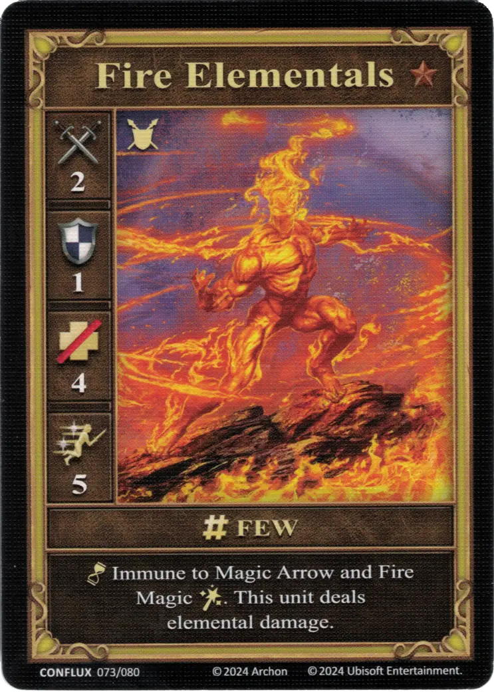
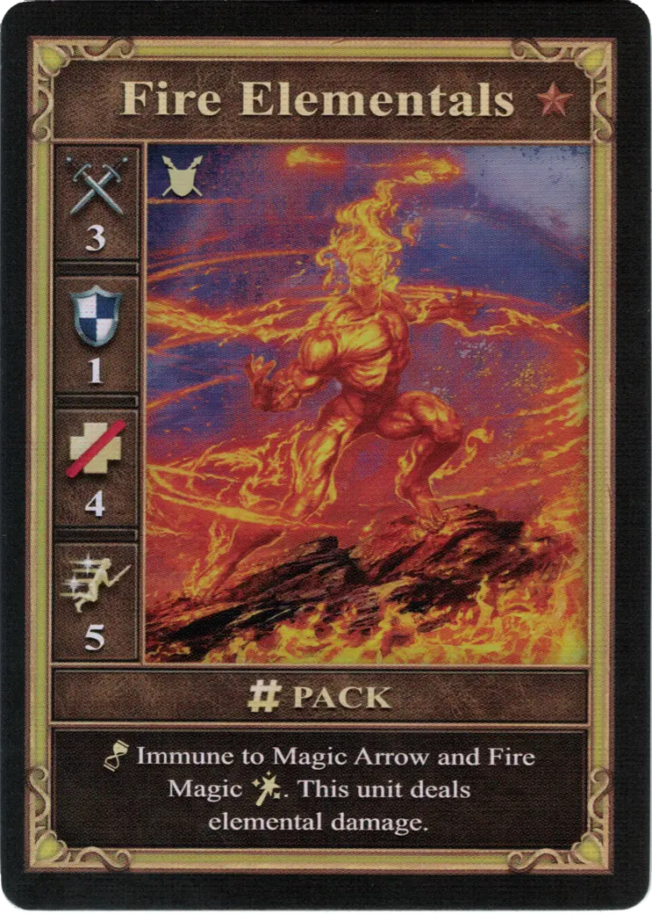
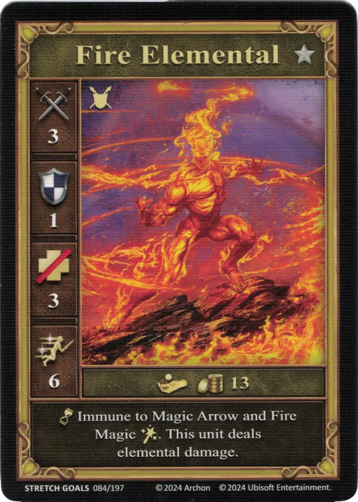

# Żywiołaki Ognia

=== "Garstka"

    <figure markdown="span">
        { width="340" align=right }
    </figure>

=== "Grupa"

    <figure markdown="span">
        { width="340" align=right }
    </figure>

=== "Neutralne"

    <figure markdown="span">
        { width="340" align=right }
    </figure>

| Statistics | Few | Pack | Neutral |
| :--- | :---: | :---: | :---: |
| Town | [Summoned](../towns/neutral.md#summoned-units) | [Summoned](../towns/neutral.md#summoned-units) | [Neutral](../towns/neutral.md) |
| Tier | :bronze_tier: | :bronze_tier: | :silver_tier: |
| Type | [:ground_unit:](index.md#ground-units) | [:ground_unit:](index.md#ground-units) | [:ground_unit:](index.md#ground-units) |
| :attack: | 2 | **3** | 3 |
| :defense: | 1 | 1 | 1 |
| :health_points: | 4 | 4 | 3 |
| :initiative: | 5 | 5 | 6 |
| Cost | - | - | 13 :gold: |
| Abilities | :unit_passive: Immune to [Magic Arrow](../spells/magic_arrow.md) and [Fire Magic :spell:](../spells/index.md#school-of-fire-magic). This unit deals elemental damage. | :unit_passive: Immune to [Magic Arrow](../spells/magic_arrow.md) and [Fire Magic :spell:](../spells/index.md#school-of-fire-magic). This unit deals elemental damage. | :unit_passive: Immune to [Magic Arrow](../spells/magic_arrow.md) and [Fire Magic :spell:](../spells/index.md#school-of-fire-magic). This unit deals elemental damage. |

## Uwagi

- Summoned by [Summon Fire Elemental](../spells/summon_fire_elemental.md).

## Pochodzi z

- [Conflux Expansion](../content/conflux_expansion.md)
- [Regular Stretch Goals 2024](../content/regular_stretch_goals.md) (Neutral)

## Zobacz też

- [Lista Jednostek](index.md)
- [Lista Zaklęć](../spells/index.md)
- [Lista Miast](../towns/index.md)
