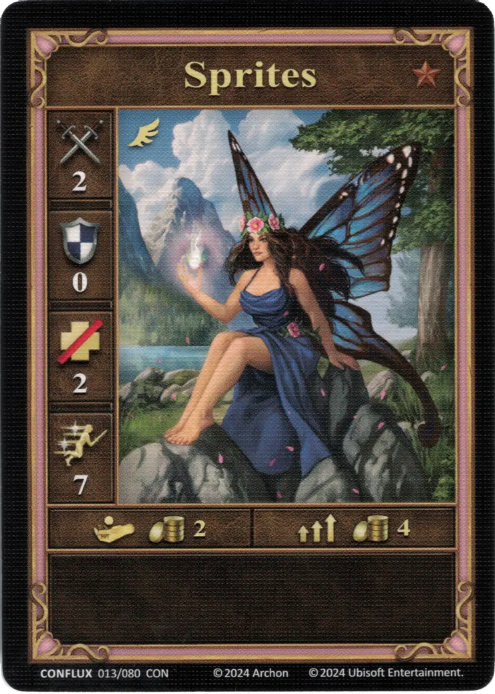
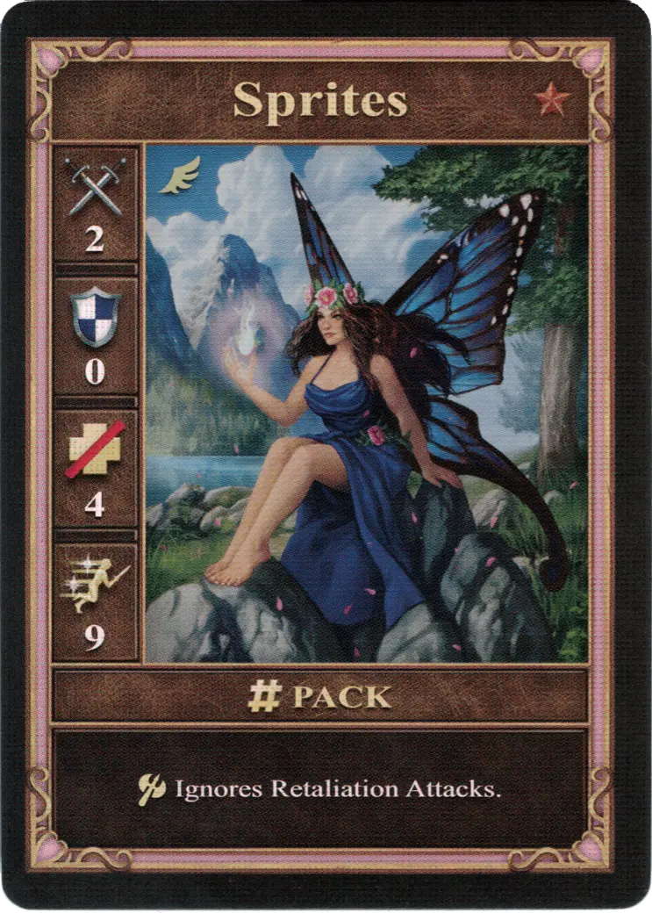
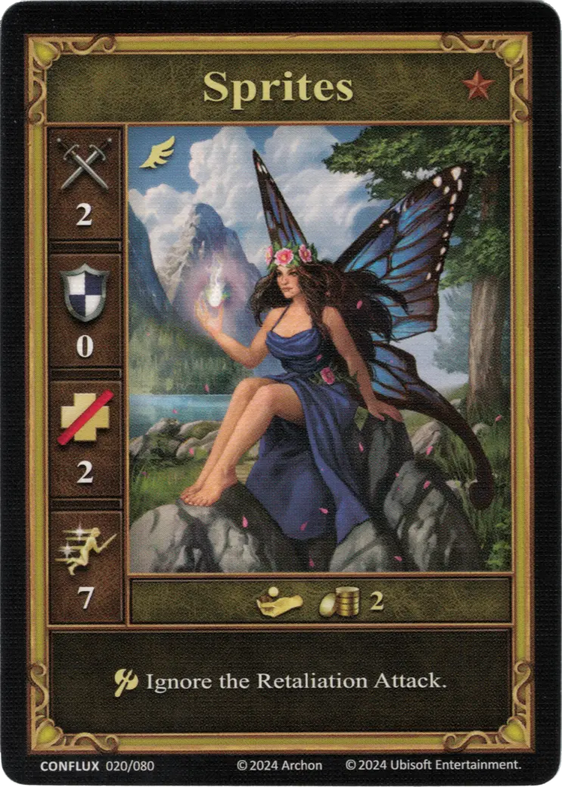

# Sprites

=== "Garstka"

    <figure markdown="span">
        { width="340" align=right }
    </figure>

=== "Grupa"

    <figure markdown="span">
        { width="340" align=right }
    </figure>

=== "Neutralne"

    <figure markdown="span">
        { width="340" align=right }
    </figure>

| Statistics | Few | Pack | Neutral |
| :--- | :---: | :---: | :---: |
| Town | [Conflux](../towns/conflux.md) | [Conflux](../towns/conflux.md) | [Neutral](../towns/neutral.md) |
| Tier | :bronze_tier: | :bronze_tier: | :bronze_tier: |
| Type | [:flying_unit:](index.md#flying-units) | [:flying_unit:](index.md#flying-units) | [:flying_unit:](index.md#flying-units) |
| :attack: | 2 | 2 | 2 |
| :defense: | 0 | 0 | 0 |
| :health_points: | 2 | **4** | 2 |
| :initiative: | 7 | **9** | 7 |
| Cost | 2 :gold: | 4 :gold: | 2 :gold: |
| Abilities | - | :unit_attack: Ignores Retaliation Attacks. | :unit_attack: Ignore the Retaliation Attacks. |

## Pochodzi z

- [Conflux Expansion](../content/conflux_expansion.md)

## Zobacz też

- [Lista Jednostek](index.md)
- [Lista Miast](../towns/index.md)
