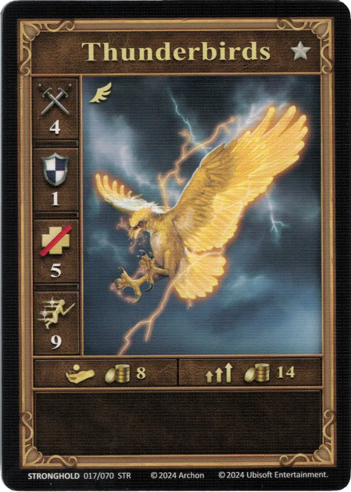
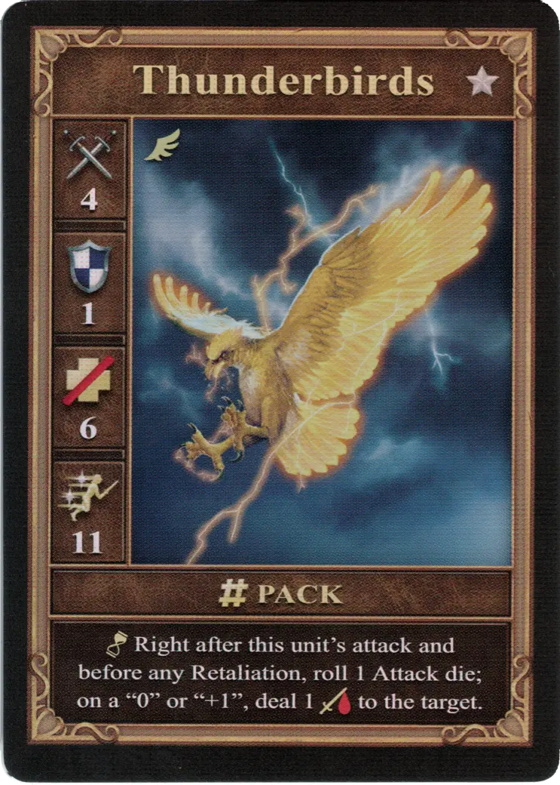
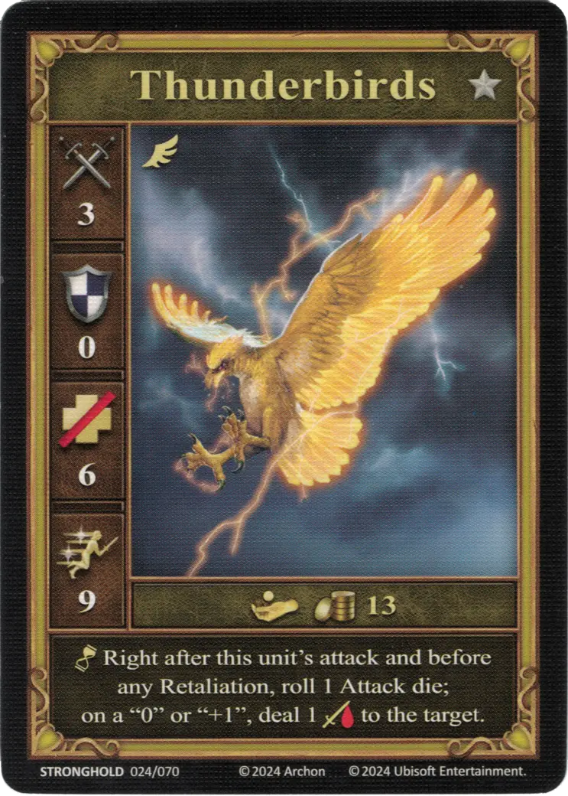

# Thunderbirds

=== "Garstka"

    <figure markdown="span">
        { width="340" align=right }
    </figure>

=== "Grupa"

    <figure markdown="span">
        { width="340" align=right }
    </figure>

=== "Neutralne"

    <figure markdown="span">
        { width="340" align=right }
    </figure>

| Statistics | Few | Pack | Neutral |
| :--- | :---: | :---: | :---: |
| Town | [Stronghold](../towns/stronghold.md) | [Stronghold](../towns/stronghold.md) | [Neutral](../towns/neutral.md) |
| Tier | :silver_tier: | :silver_tier: | :silver_tier: |
| Type | [:flying_unit:](index.md#flying-units) | [:flying_unit:](index.md#flying-units) | [:flying_unit:](index.md#flying-units) |
| :attack: | 4 | 4 | 3 |
| :defense: | 1 | 1 | 0 |
| :health_points: | 5 | **6** | 6 |
| :initiative: | 9 | **11** | 9 |
| Cost | 8 :gold: | 14 :gold: | 13 :gold: |
| Abilities | - | :unit_passive: Right after this unit's attack and before any Retaliation, roll 1 [Attack die](../keywords/dice.md#attack-die), on a "0" or "+1", deal 1 :damage: to the target. | :unit_passive: Right after this unit's attack and before any Retaliation, roll 1 [Attack die](../keywords/dice.md#attack-die), on a "0" or "+1", deal 1 :damage: to the target. |

## Bohaterowie ze Specjalnością

- [:might: Shiva](../heroes/shiva.md#specialty)

## Pochodzi z

- [Rozszerzenie Twierdza](../content/stronghold_expansion.md)

## Zobacz też

- [Lista Jednostek](index.md)
- [Lista Miast](../towns/index.md)
